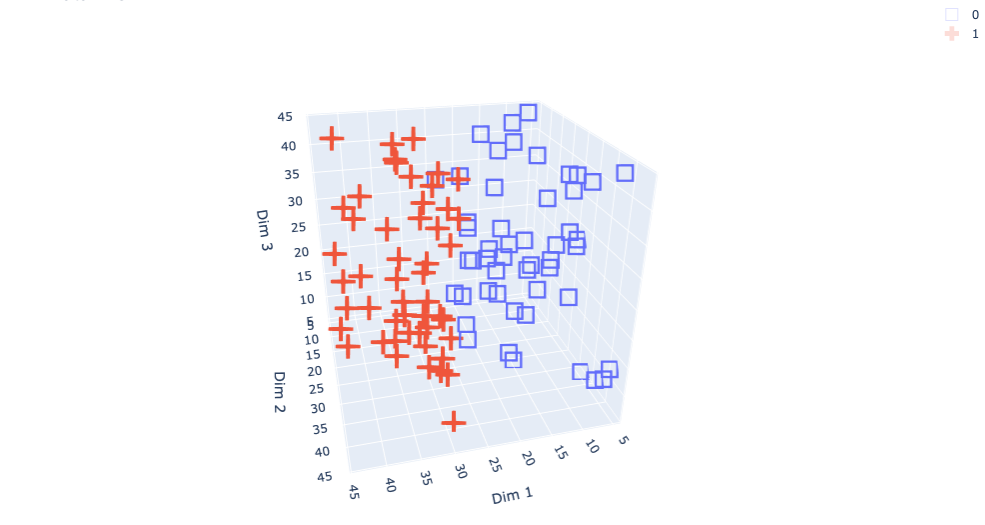

# Simple Voxel 3D
Simple voxel datasets for classification and segmentation tasks in 3D

Datasets:
1. Left/Right Classification

## 1. A left/right classification dataset

This dataset generates shapes (only cubes for now) with centers distributed along 3 spatial axes. The label corresponds to their position on the x-axis with: 
- label 0: left (xi < half width of x axis)
- label 1: right (xi > half width of x axis)

### Example center distribution

