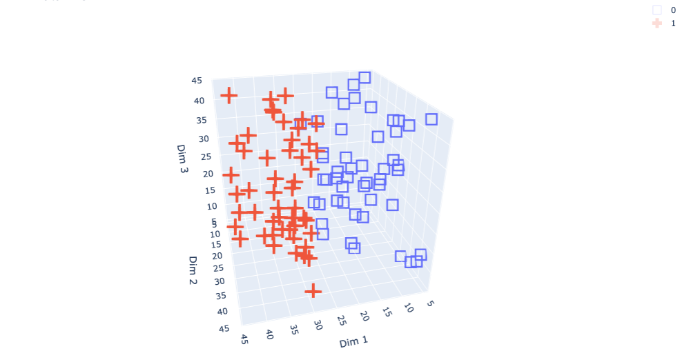

# A left/right classification dataset

This dataset generates shapes (only cubes for now) with centers distributed along 3D spatial axes. The label corresponds their position on the x-axis with: 
- label 0: left (xi < half width of x axis)
- label 1: right (xi > half width of x axis)

## Example center distribution

